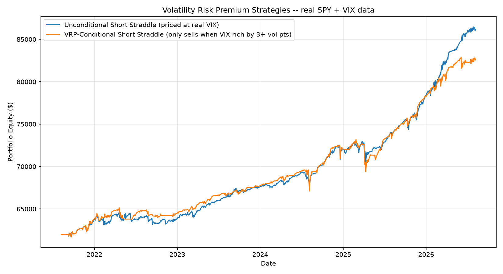

# Options Pricing & Volatility Research Engine

A personal quantitative research project: an options pricing engine
(Black-Scholes, binomial tree, Monte Carlo), an event driven backtester, and
an empirical study of the S&P 500 volatility risk premium using real market
data.

**[Full write-up with methodology, validation, and results →](PROJECT_WRITEUP.md)**

## Key result

Using 5 years of real VIX and SPY data, implied volatility exceeded realized
volatility on **85% of trading days** (avg. +3.6 vol points), a direct,
real data measurement of the volatility risk premium. A strategy that only
sold volatility when this premium was elevated *underperformed* an
unconditional version on a risk-adjusted basis. I tested two hypotheses for
why, ruled both out with the trade data, and isolated the actual cause: an
opportunity-cost effect from binary signal filtering, not a signal-quality
problem. Full investigation can be found in the write up (Section 6.3).



## What's here

| | |
|---|---|
| `options_pricer/` | Pricing engine: Black-Scholes + Greeks, binomial tree (American exercise), Monte Carlo, live options chain access, implied vol surface construction |
| `backtest/` | Event-driven backtesting engine: portfolio accounting, 4 strategies (buy & hold, covered call, delta-hedged short straddle, VRP-conditional straddle) |
| `demo.py` | Pricing engine demo + cross-validation (no internet required) |
| `run_backtest.py` | Strategy comparison backtest |
| `vrp_backtest.py` | Volatility risk premium measurement using real VIX data |
| `vrp_threshold_sweep.py` | Threshold sensitivity analysis + trade-level P&L breakdown |
| `trade_timeline_diagnostic.py` | Hypothesis testing on *why* the conditional strategy underperformed |
| `PROJECT_WRITEUP.md` | Full methodology, validation, results, and limitations |

## Validation, not just implementation

Every pricing method here is cross-checked against the others rather than
trusted on its own:
- Binomial tree converges to Black-Scholes to within 0.3 cents
- American call price exactly equals European price for non-dividend
  underliers (the correct theoretical result)
- Monte Carlo (500k paths) lands within its own 95% CI of the closed-form price
- Put-call parity holds to 6 decimal places
- The backtest engine was proven edge-neutral under controlled conditions
  *before* being trusted on real data (see write-up, Section 4)

## Quickstart

```bash
pip install -r requirements.txt

python demo.py              # no internet required
python run_backtest.py      # real data if available, else synthetic fallback
python vrp_backtest.py      # requires internet (pulls SPY + VIX history)
python vrp_threshold_sweep.py
python trade_timeline_diagnostic.py
```

## Known limitations

Stated explicitly in the write up (Section 7) rather than glossed over:
single historical test window with no walk-forward validation, European
pricing used for American options, no margin modeling, and VIX-based
strategies only extend to index/SPY level trades (no free implied vol
history exists for individual names). This project is a research and
backtesting framework, so it does not place live trades.

## License

MIT — see [LICENSE](LICENSE).
